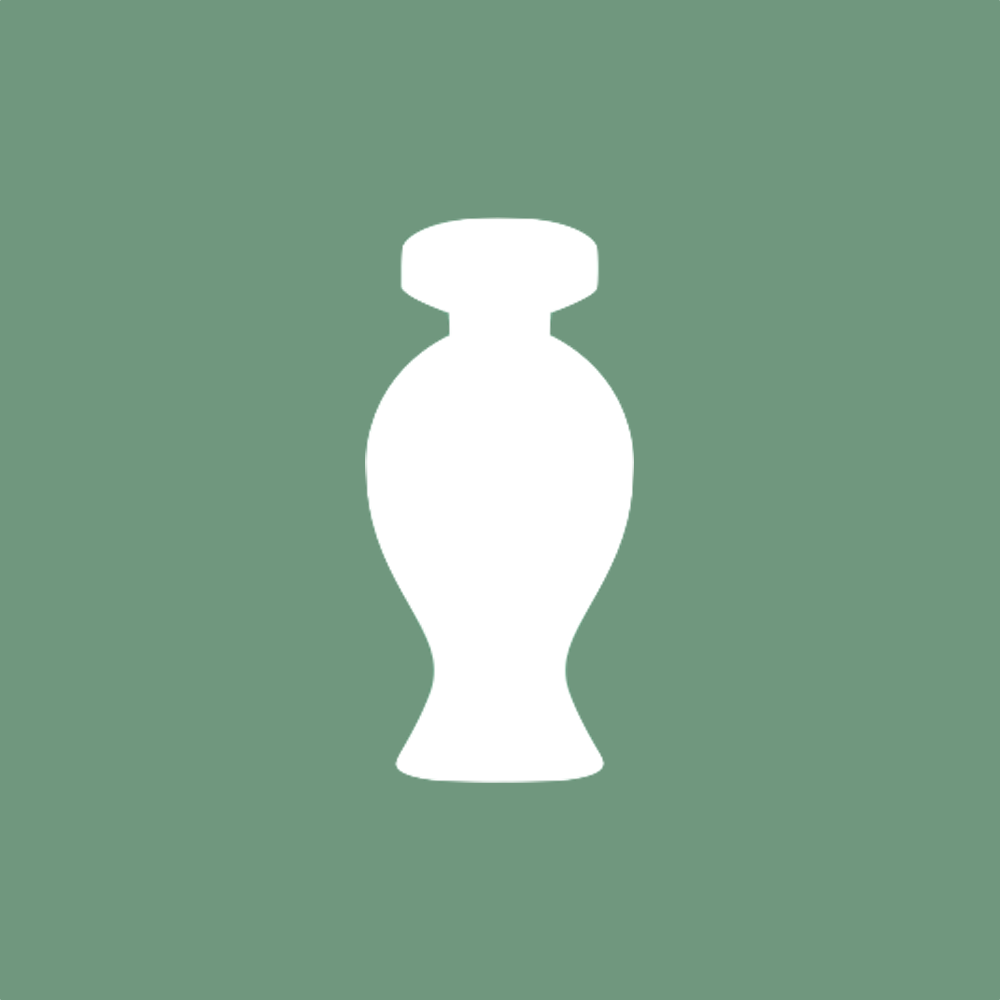
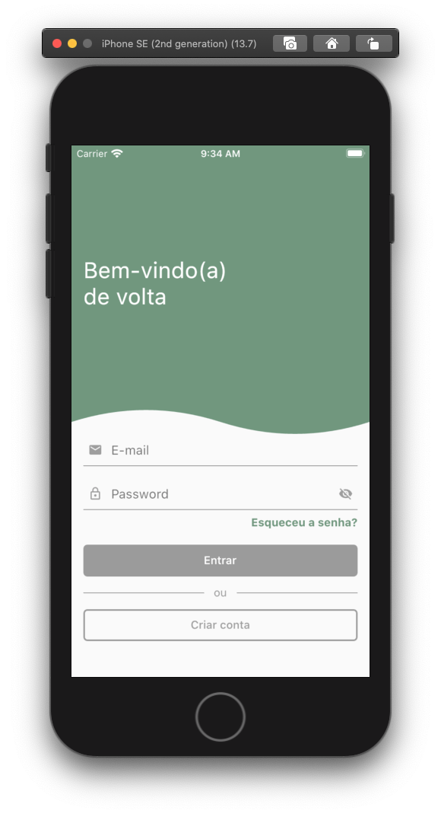
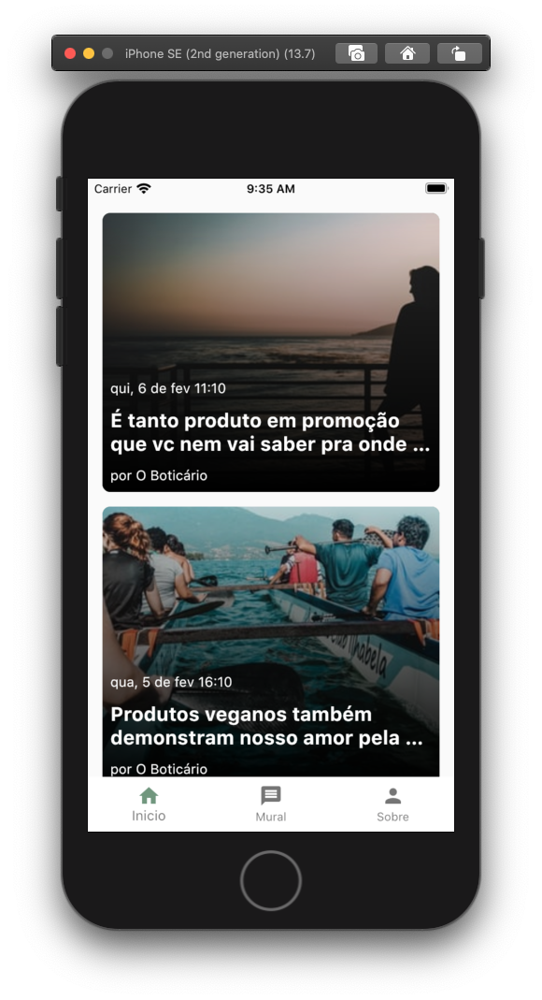
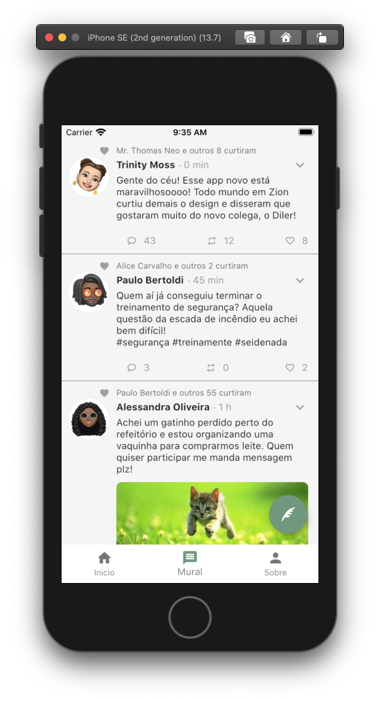
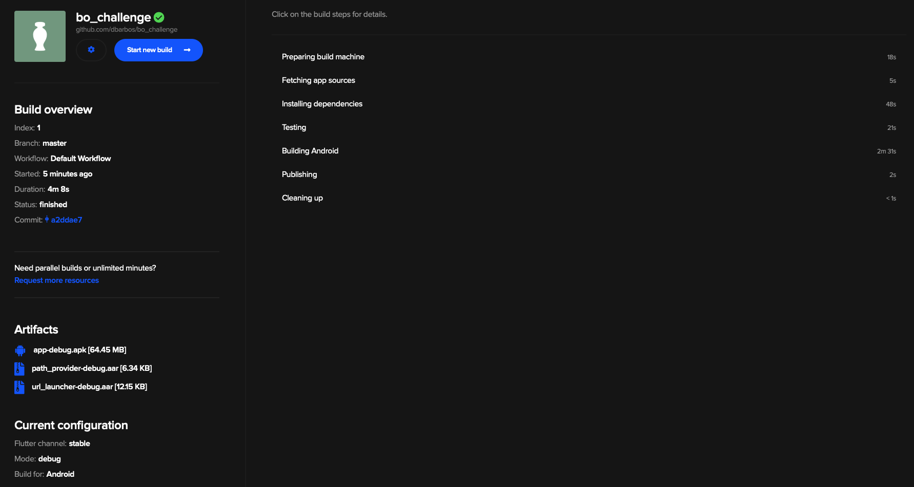
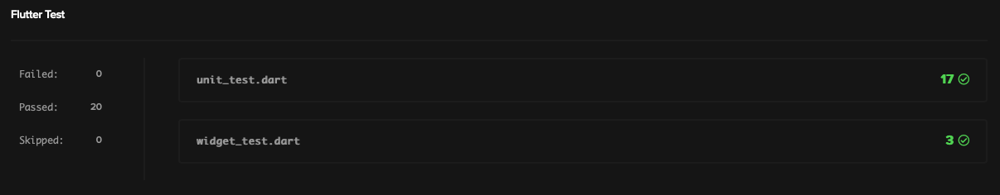

[](https://codemagic.io/apps/5f62be89448c7081a182d3db/5f62be89448c7081a182d3da/latest_build)
[![MIT License][license-shield]][license-url]
[![LinkedIn][linkedin-shield]][linkedin-url]

<!-- PROJECT LOGO -->
<br />
<p align="center">
  

  <h3 align="center">Boti Challenge</h3>

  <p align="center">
    Um projeto de demonstração feito em Flutter com MobX
    <br />
    
  </p>
</p>

<!-- TABLE OF CONTENTS -->

## Table of Contents

- [Sobre o Projeto](#about-the-project)
  - [Desenvolvido Usando](#built-with)
- [Começando](#getting-started)
  - [Prerequisitos](#prerequisites)
  - [Instalação](#installation)
- [Resultado do build para Android](#getting-started)
- [Resultado dos Testes](#getting-started)
- [Baixe o APK](#getting-started)
- [Para Contribuir](#contributing)
- [Lisença](#license)
- [Contato](#contact)

<!-- ABOUT THE PROJECT -->

## Sobre o Projeto

<div style="width:100%">
  
  
  
</div>

</br>

O objetivo deste projeto é apresentar uma aplicação construida em Flutter com a finalidade de apresentar um tipo de blog corporativo onde é possível acessar as novidades sobre a empresa através de uma tela de "novidades" que busca os dados por uma API. Além disse existe também um mural, com design baseado no app do Twitter, onde é possível ver o que os colegas de empresa estão falando, curtir e compartilhar suas próprias ideias.

Aqui estão todas as funcionalidades:

- Formulário de login que valida o e-mail e a senha digitados antes de liberar a entrada
- Tela para criar conta que valida o nome, email e passwor antes de permitir a criação. Após isso faz o login automaticamente
- Tela de novidades que busca os dados da API https://gb-mobile-app-teste.s3.amazonaws.com/data.json e os apresenta em uma lista. (Obs.: As imagens apresentadas são na verdade de um serviço de imagens terceiro, já que as imagens da API sugeridas não estão funcionando)
- Tela de mural para ver mensagens dos colegas e postar novas mensagens
- Tela sobre os detalhes do desenvolvedor

As ações na aplicação são mockadas para demonstrar o funcionamento.

### Construído Com

Nesta parte eu listo quais foram os principais frameworks e serviços utilizados para construir o App.

- [Flutter](https://flutter.dev)
- [Pub.dev](https://pub.dev)
- [MobX](https://mobx.netlify.app)

<!-- GETTING STARTED -->

## Começando

Após clonar o repositório você precisa verificar alguns detalhes para garantir que tudo rode normalmente. Para clonar o projeto use o comando.

```sh
git clone https://github.com/dbarbos/bo_challenge.git
```

### Prerequisitos

Verifique se você está usando a versão estável do Flutter stable.

Para isso use o seguinte comando para ver qual o canal atual

```sh
flutter channel
```

Para mudar para o canal stable use o comando para mudar o canal e em seguida faça o upgrade

```sh
flutter channel stable
flutter upgrade
```

Para baixar e atualizar as dependências use o comando

```sh
flutter upgrade
```

<!-- Building -->

## Resultado do build para Android



<!-- Testing -->

## Resultado dos Testes



<!-- Baixe o APK -->

## Baixe o APK

Para testar o app diretamente no seu aparelho Android clique no link abaixo para baixar o APK

<a href="https://github.com/dbarbos/bo_challenge/blob/master/APK/app-debug.apk">Baixe o APK</a>

<!-- CONTRIBUTING -->

## Para Contribuir

Para contribuir com esse projeto basta seguir os passos:

1. Faça um fork do projeto
2. Crie uma branch (`git checkout -b feature/AmazingFeature`)
3. Faça um commit das suas mudanças (`git commit -m 'Add some AmazingFeature'`)
4. Faça um Push da branch (`git push origin feature/AmazingFeature`)
5. Faça Pull Request

<!-- LICENSE -->

## Lisença

Distributed under the MIT License. See `LICENSE` for more information.

<!-- CONTACT -->

## Contato

Dilermando Barbosa Jr - dilermando.barbosa@gmail.com

<!-- MARKDOWN LINKS & IMAGES -->
<!-- https://www.markdownguide.org/basic-syntax/#reference-style-links -->

[contributors-shield]: https://img.shields.io/github/contributors/othneildrew/Best-README-Template.svg?style=flat-square
[contributors-url]: https://github.com/othneildrew/Best-README-Template/graphs/contributors
[forks-shield]: https://img.shields.io/github/forks/othneildrew/Best-README-Template.svg?style=flat-square
[forks-url]: https://github.com/othneildrew/Best-README-Template/network/members
[stars-shield]: https://img.shields.io/github/stars/othneildrew/Best-README-Template.svg?style=flat-square
[stars-url]: https://github.com/othneildrew/Best-README-Template/stargazers
[issues-shield]: https://img.shields.io/github/issues/othneildrew/Best-README-Template.svg?style=flat-square
[issues-url]: https://github.com/othneildrew/Best-README-Template/issues
[license-shield]: https://img.shields.io/github/license/othneildrew/Best-README-Template.svg?style=flat-square
[license-url]: https://github.com/dbarbos/bo_challenge/blob/master/LICENSE.txt
[linkedin-shield]: https://img.shields.io/badge/-LinkedIn-black.svg?style=flat-square&logo=linkedin&colorB=555
[linkedin-url]: https://linkedin.com/in/dilerbarbosa
[product-screenshot]: images/screenshot.png
